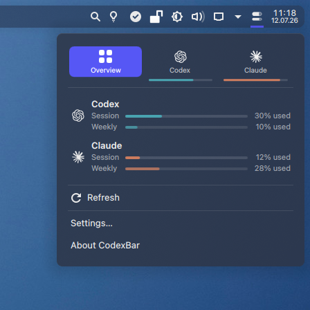

# CodexBar for KDE Plasma

A KDE Plasma 6 panel widget that keeps AI coding-provider limits visible —
a faithful re-creation of [CodexBar](https://github.com/steipete/CodexBar)
(Peter Steinberger's macOS menu bar app), driven by the official CodexBar CLI.



## Features

- **Panel icon in the original look:** two meter capsules (session on top,
  weekly below), fill = remaining quota, dimmed when data is stale. Default is
  one merged icon showing the worst case across all enabled providers;
  optionally one icon per provider, with the original "critter" faces for
  Codex (eyes) and Claude (asterisk). Optional percentage label.
- **Popup like the original menu:** provider switcher tabs with brand-colored
  quota bars, an overview page, and per provider: session / weekly / extra
  rate windows ("Codex Spark", model-scoped weekly caps, …) with progress
  bars, reset countdowns and a pace line, Codex reset credits, cost
  (today / last 30 days from local token logs via `codexbar cost`),
  provider status and account info.
- **Actions:** Refresh, Usage Dashboard, Status Page, Settings, About.
- **Settings:** refresh interval, any of the 58 providers the CLI supports,
  panel percentage (session/weekly/lowest, remaining/used), plain bars,
  cost/status toggles, custom CLI path.

## Requirements

- KDE Plasma 6 (`kpackagetool6`)
- The [CodexBar CLI](https://github.com/steipete/CodexBar#cli) on your PATH
  (or set its location in the widget settings):

  ```bash
  # Homebrew
  brew install steipete/tap/codexbar
  # or download CodexBarCLI-v<tag>-linux-<arch>.tar.gz from the CodexBar
  # releases page and drop the binary into ~/.local/bin/codexbar
  ```

  The CLI reads the credentials of the provider tools you already use
  (Claude Code, Codex CLI, …) — no extra login required.

## Install

```bash
git clone https://github.com/psimaker/codexbar-plasmoid.git
cd codexbar-plasmoid
kpackagetool6 -t Plasma/Applet -i .
```

Then add **CodexBar** to a panel (right-click the panel → *Add Widgets…*).

Update an existing installation:

```bash
kpackagetool6 -t Plasma/Applet -u .
systemctl --user restart plasma-plasmashell.service   # reload cached QML
```

## Not ported (macOS-only upstream features)

Menu bar animations (blink/wiggle), WidgetKit widgets, notifications,
cost-history charts, the multi-account UI and the "Add Account" flow —
logins are handled by the provider CLIs themselves.

## Credits & license

MIT — see [LICENSE](LICENSE). This is an independent community port; all
credit for the concept, the design and the CLI goes to
[Peter Steinberger's CodexBar](https://github.com/steipete/CodexBar).
The provider icon SVGs are taken from the upstream repository (MIT).
