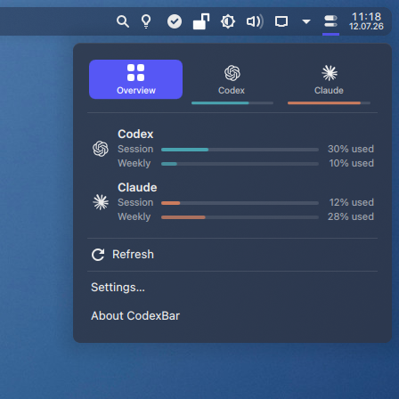

# CodexBar for KDE Plasma

A KDE Plasma 6 panel widget that keeps AI coding-provider limits visible —
a faithful re-creation of [CodexBar](https://github.com/steipete/CodexBar)
(Peter Steinberger's macOS menu bar app), driven by the official CodexBar CLI.



## Features

- **Panel icon in the original look:** two meter capsules (session on top,
  weekly below), fill = remaining quota, dimmed when data is stale. Default is
  one merged icon showing the worst case across all enabled providers;
  optionally one icon per provider, with the original "critter" faces for
  Codex (eyes) and Claude (asterisk). Optional percentage label.
- **Popup like the original menu:** provider switcher tabs with brand-colored
  quota bars, an overview page, and per provider: session / weekly / extra
  rate windows ("Codex Spark", model-scoped weekly caps, …) with progress
  bars, reset countdowns and a pace line, Codex reset credits, cost
  (today / last 30 days from local token logs via `codexbar cost`),
  provider status and account info. Cost scanning is disabled by default
  because large local histories can be resource-intensive.
- **Actions:** Refresh, explicit cost-history refresh, Usage Dashboard, Status
  Page, Settings, About.
- **Optional Claude multi-account view:** stacked 5-hour and 7-day cards,
  active-account state, and explicit account switching through a compatible
  schema-v1 `claude-swap` adapter.
- **Settings:** refresh interval, any of the 58 providers the CLI supports,
  panel percentage (session/weekly/lowest, remaining/used), plain bars,
  cost/status toggles, custom CLI path, Claude account adapter.

## Requirements

- KDE Plasma 6 (`kpackagetool6`)
- The [CodexBar CLI](https://github.com/steipete/CodexBar#cli) v0.43.0 or
  newer on your PATH (or set its location in the widget settings). CodexBar
  CLI v0.42.1 has a known Linux crash while formatting rate-limit windows,
  fixed in [v0.43.0](https://github.com/steipete/CodexBar/releases/tag/v0.43.0):

  ```bash
  # Homebrew
  brew install steipete/tap/codexbar
  # or download CodexBarCLI-v<tag>-linux-<arch>.tar.gz from the CodexBar
  # releases page. Keep CodexBarCLI and VERSION together so --version works:
  mkdir -p ~/.local/share/codexbar-cli ~/.local/bin
  tar -xzf CodexBarCLI-v<tag>-linux-<arch>.tar.gz -C ~/.local/share/codexbar-cli
  ln -sfn ~/.local/share/codexbar-cli/CodexBarCLI ~/.local/bin/codexbar
  ```

  The CLI reads the credentials of the provider tools you already use
  (Claude Code, Codex CLI, …) — no extra login required.

## Cost refresh behavior

Quota refreshes never start local-history cost scans. When the optional cost
section is enabled, automatic cost scans are serialized and run no more than
once per provider per hour. Use **Refresh cost history** on a Codex or Claude
provider page when an immediate scan is required.

### Optional Claude multi-account adapter

Enable **Show all accounts from a schema-v1 adapter** and set the adapter
executable path. Compatible adapters must implement only these CodexBar
operations:

```text
--list --json
--switch-to <positive-slot> --json
```

The widget validates schema version 1 and retains only account slot, optional
`alias`/`organizationName`/email display identity, active state, the optional
`disabled` rotation flag, usage status, the 5-hour/7-day usage windows,
optional model-scoped weekly windows, and optional pay-as-you-go `spend`
(`used`/`limit`/`pct`/`currency`), which only the adapter can report per
account. When present, identity is displayed as `alias`, then
`organizationName`, then email.
Each account row may optionally report `usageFetchedAt` (ISO 8601 timestamp) or
`usageAgeSeconds` (non-negative seconds); when present, the card timestamp and
staleness reflect measurement time rather than poll time, so cached usage is
shown as stale instead of fresh. When a live fetch fails, a row may instead
carry `lastGoodUsage` with `lastGoodFetchedAt`/`lastGoodAgeSeconds`; those
windows go through the same strict projection, are timestamped from the
last-good measurement, and are labelled `last known` instead of being shown as
current. It does not read credentials or profile IDs.

Weekly windows (`sevenDay` and model-scoped entries) may additively report the
adapter's own pace verdict as `expectedPct`/`aheadOfPace`; when present it is
preferred over the pace line the widget otherwise reconstructs locally. The
`projectedExhaustionAt`/`willLastToReset` projections are deliberately not
read — claude-swap keeps that linear extrapolation out of its human surfaces.

Account switches are serialized and only run after an explicit click. The
switch action is offered for the `ok`, `api_key`, `unavailable`,
`token_expired`, and `foreign_credential` statuses — the last two because an
explicit switch is what refreshes an expired token or replaces a credential
belonging to another account. `keychain_unavailable`, `no_credentials`, and
`relogin_required` instead report what has to be fixed outside the widget. A
`disabled` slot is only held out of the adapter's automatic rotation and stays
a valid explicit target, so the card labels it `Not in rotation` without
withdrawing the switch action. Any `warnings` the switch result carries are
shown afterwards, including on a successful switch: in `--json` mode adapters
report them in the payload rather than on stderr, so this is the only place
they can reach you.

Examples:

- Install [`claude-swap`](https://github.com/realiti4/claude-swap) and leave
  the path empty to use `cswap` from `PATH`.
- For another compatible adapter, set its absolute path or a path beginning
  with `~/`.

The CodexBar CLI remains required: normal Claude usage continues to power the
panel icon, overview, cost, provider status, and fallback card.

## Install

```bash
git clone https://github.com/psimaker/codexbar-plasmoid.git
cd codexbar-plasmoid
kpackagetool6 -t Plasma/Applet -i .
```

Then add **CodexBar** to a panel (right-click the panel → *Add Widgets…*).

Update an existing installation:

```bash
kpackagetool6 -t Plasma/Applet -u .
systemctl --user restart plasma-plasmashell.service   # reload cached QML
```

## Not ported (macOS-only upstream features)

Menu bar animations (blink/wiggle), WidgetKit widgets, notifications,
cost-history charts, and the "Add Account" flow — logins are handled by the
provider CLIs themselves.

## Credits & license

MIT — see [LICENSE](LICENSE). This is an independent community port; all
credit for the concept, the design and the CLI goes to
[Peter Steinberger's CodexBar](https://github.com/steipete/CodexBar).
The provider icon SVGs are taken from the upstream repository (MIT).
