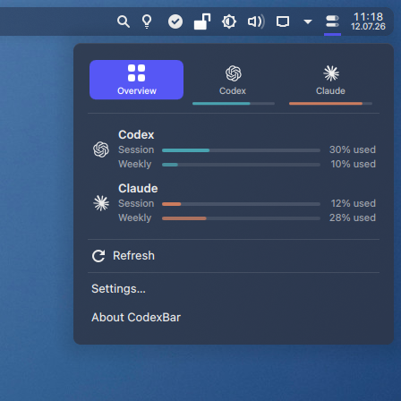
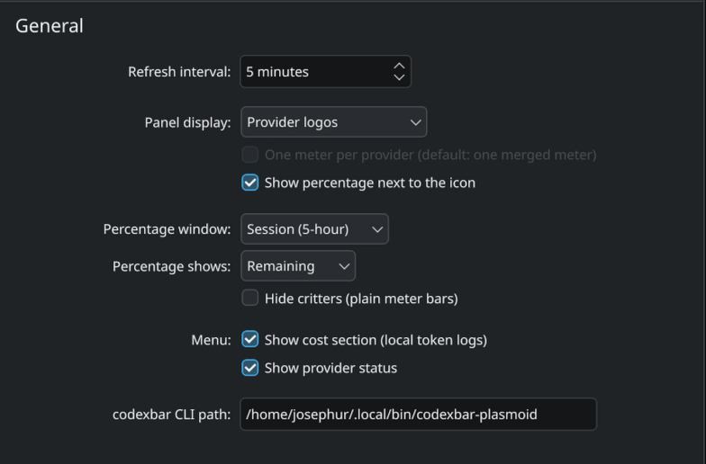
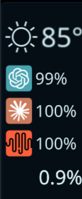

<div align="center">



# CodexBar for KDE Plasma 6

**Your AI coding limits, always visible in the panel.**

A faithful KDE Plasma port of [CodexBar](https://github.com/steipete/CodexBar), Peter Steinberger's macOS menu bar app.
Codex, Claude, Cursor, Copilot, Gemini and 80+ more providers, driven by the official CodexBar CLI.

[](https://github.com/psimaker/codexbar-plasmoid/releases/latest)
[](https://github.com/psimaker/codexbar-plasmoid/actions/workflows/package-plasmoid.yml)
[](https://kde.org/plasma-desktop/)
[](https://github.com/steipete/CodexBar/blob/main/docs/cli.md)
[](LICENSE)

</div>

<a id="install"></a>

## ⚡ Install in one line

```bash
curl -fsSL https://raw.githubusercontent.com/psimaker/codexbar-plasmoid/main/scripts/install.sh | sh
```

Then right-click your panel → **Add Widgets…** → search **CodexBar**. That's it.

| | What the one-liner does |
|---|---|
| 🧩 **Widget** | Downloads the latest `.plasmoid` release, verifies its SHA-256 checksum and installs it with `kpackagetool6`. |
| 🖥️ **CLI** | Downloads the official CodexBar CLI build for your CPU (`x86_64` / `aarch64`), verifies the checksum and links it as `~/.local/bin/codexbar`. |
| 🔒 **Safe** | User-local only, no root, nothing outside `~/.local`. Re-run it any time to update both. |

> [!TIP]
> Already have the widget? It installs and updates the CLI by itself: the popup shows an **Install CodexBar CLI** button when the CLI is missing or too old, and **About CodexBar** offers **Update CodexBar CLI to the latest release**.

Options: `--widget-only`, `--cli-only`, `--version v0.6.1`. The scripts are plain POSIX `sh`, so read them first if you like: [`scripts/install.sh`](scripts/install.sh) and [`contents/scripts/install-cli.sh`](contents/scripts/install-cli.sh). Manual and package-manager routes are [below](#other-ways-to-install).

## ✨ Features

- **Panel icon in the original look.** Two meter capsules (session on top, weekly below), fill = remaining quota, dimmed when data is stale. One merged icon showing the worst case across providers by default, or one icon per provider with the original "critter" faces for Codex and Claude. Optional percentage label, optionally with the time until that window resets (`40% · 3h 50m`), or provider logos instead of meters. **Usage bars fill** in the General settings switches every meter and bar between remaining quota (default, as in CodexBar) and used quota. Per-provider overrides let single providers look different from the rest.
- **Popup like the original menu.** Provider switcher tabs with brand-colored quota bars, an overview page, and per provider: session / weekly / extra rate windows ("Codex Spark", model-scoped weekly caps, …) with progress bars, reset countdowns and a pace line, Codex reset credits, local cost (today / last 30 days via `codexbar cost`), provider status, account info, and the CLI's detail rows (balances, monthly spend, credit pools, …).
- **Actions.** Refresh, cost-history refresh, Usage Dashboard, Status Page, Settings, About. A middle or double click on a panel icon can refresh, open the usage dashboard or status page, or run a command such as `konsole -e codex`, globally or per provider.
- **90 providers.** Everything the CodexBar CLI supports, enable only what you use.
- **Optional Claude multi-account view.** Stacked 5-hour and 7-day cards per account with explicit switching through a schema-v1 [`claude-swap`](https://github.com/realiti4/claude-swap) adapter.

<div align="center">

<br>
&nbsp;&nbsp;

</div>

<details>
<summary><b>All 90 supported providers</b></summary>
<br>

Codex · OpenAI · Azure OpenAI · Claude · ClinePass · Cursor · OpenCode · OpenCode Go · Alibaba Coding Plan · Alibaba Token Plan · Qwen Cloud · Droid · Fireworks · Gemini · Antigravity · Copilot · Devin · z.ai / GLM · MiniMax · Manus · Kimi Code · Kilo · Kiro · Vertex AI · Augment · JetBrains AI · Moonshot / Kimi Open Platform · Amp · T3 Chat · Ollama · Synthetic · OpenRouter · ElevenLabs · Warp · Windsurf · Zed · Perplexity · Xiaomi MiMo · Doubao · Sakana AI · Abacus AI · Mistral · DeepSeek · DeepInfra · Codebuff · Venice · Command Code · Qoder · StepFun · AWS Bedrock · Grok · Groq · LLM Proxy · LiteLLM · Bifrost · Aixy · Deepgram · Poe · Chutes · Neuralwatt · Helmcode · ClawRouter · LongCat · sub2api · Wayfinder · ZenMux · ai& · ZoomMate · xAI · Notion AI · IBM Bob · Nous Portal · Muse Code · CodeRabbit · Replicate · Hugging Face · Raycast · Pi · v0 · TypeSafe · Charm Hyper · GitKraken AI · DevPass · Atlas Cloud · Vercel AI Gateway · llmman · xKiro · Muse (muse.ai) · LithosAI · WorkBuddy

Provider logins are handled by the provider tools themselves (Claude Code, Codex CLI, API keys in CodexBar's config, …); the widget only reads what the CLI reports. When a probe fails, the provider's card shows the CLI's own message, for example that a login is missing. Some newer providers need a recent CLI, which the widget tells you as well.
</details>

## 📋 Requirements

- **KDE Plasma 6** (`kpackagetool6`)
- **CodexBar CLI 0.43.0 or newer**, latest recommended. The one-liner and the widget install it for you; see [other ways](#other-ways-to-install) for Homebrew, AUR or a manual download.

The widget and the CLI are separate: the CLI is not bundled inside the `.plasmoid`, but the widget bundles an installer for it.

<a id="other-ways-to-install"></a>
<a id="install-the-codexbar-cli"></a>

## 🛠️ Other ways to install

<details>
<summary><b>Widget from a <code>.plasmoid</code> file</b></summary>
<br>

1. Download the current `.plasmoid` file from [GitHub Releases](https://github.com/psimaker/codexbar-plasmoid/releases).
2. Right-click the Plasma panel or desktop and select **Add Widgets…**.
3. Select **Get New Widgets** → **Install Widget From Local File…** and pick the downloaded file.
4. Search for **CodexBar** and add it to the panel.

From a terminal instead:

```bash
kpackagetool6 -t Plasma/Applet -i com.github.psimaker.codexbar-<version>.plasmoid   # install
kpackagetool6 -t Plasma/Applet -u com.github.psimaker.codexbar-<version>.plasmoid   # update
kpackagetool6 -t Plasma/Applet -r com.github.psimaker.codexbar                     # remove
```

Each release ships a `.sha256` file. Download it next to the `.plasmoid` and verify before installing:

```bash
sha256sum -c com.github.psimaker.codexbar-<version>.plasmoid.sha256
```

An updated widget takes effect after Plasma reloads it (log out and in, or `systemctl --user restart plasma-plasmashell.service`).

A KDE Store listing is planned but not published yet; until then use the release package.
</details>

<details>
<summary><b>CodexBar CLI: widget button, Homebrew, AUR or manual download</b></summary>
<br>

The widget finds `codexbar` on `PATH` (including `~/.local/bin`). Alternatively right-click the widget → **Configure CodexBar…** and set a custom CLI path.

- **From the widget.** Setup card → **Install CodexBar CLI**, or About page → **Update CodexBar CLI to the latest release**. Same installer as the one-liner: official release archive, checksum verified, user-local.
- **Homebrew / Linuxbrew:** `brew install steipete/tap/codexbar`
- **Arch Linux (AUR):** `yay -S codexbar-cli`
- **Manual download.** Get `CodexBarCLI-v<tag>-linux-<arch>.tar.gz` from the [CodexBar releases](https://github.com/steipete/CodexBar/releases) (a static `linux-musl` build exists for systems with an older glibc). Extract the whole archive and keep `CodexBarCLI`, its `VERSION` file and the `CodexBar_CodexBarCore.bundle` directory together:

  ```bash
  mkdir -p ~/.local/share/codexbar-cli/<tag> ~/.local/bin
  tar -xzf CodexBarCLI-v<tag>-linux-<arch>.tar.gz -C ~/.local/share/codexbar-cli/<tag>
  ln -sfn ~/.local/share/codexbar-cli/<tag>/CodexBarCLI ~/.local/bin/codexbar
  ~/.local/bin/codexbar --version
  ```
</details>

<details>
<summary><b>From source (development)</b></summary>
<br>

```bash
git clone https://github.com/psimaker/codexbar-plasmoid.git
cd codexbar-plasmoid
kpackagetool6 -t Plasma/Applet -i .     # later: -u . to update
tests/run-tests.sh
```

`scripts/build-plasmoid.sh` builds the same minimal package used for releases from the committed `HEAD` (or a Git ref such as `v0.3.1`) and writes the `.plasmoid` plus its SHA-256 checksum under `dist/`. Existing output is preserved unless `--force` is supplied. The archive contains only `metadata.json`, `contents/` and `LICENSE`.

Before opening a pull request, read [CONTRIBUTING.md](CONTRIBUTING.md): which settings belong in CodexBar's `config.json` and which in the widget, and what a reviewable pull request looks like.
</details>

## ⚙️ Behavior notes

<details>
<summary><b>Cost refresh</b></summary>
<br>

Cost scanning is off by default because large local histories can be resource-intensive. Quota refreshes never start local-history cost scans. When the cost section is enabled, automatic scans are serialized and run at most once per provider per hour. Use **Refresh cost history** on a Codex or Claude page when you need an immediate scan.
</details>

<details>
<summary><b>Providers and CodexBar's config.json</b></summary>
<br>

With CodexBar CLI 0.66 or newer, the provider list and which providers are enabled come from CodexBar's own `~/.config/codexbar/config.json`, which the CLI and the macOS app share. Providers enabled with `codexbar config enable` show up in the widget, providers from user plugins included, and ticking a provider on the **Providers** page writes the change back with `codexbar config enable` / `disable` when you click **Apply**. Changes are written one after the other, so the last Apply wins. While the page is open, it follows config.json: a provider you enable with the CLI meanwhile shows up ticked and stays enabled when you click **OK**. If a change cannot be written, for example because config.json is read-only, the popup and the **Providers** page show the CLI's error until a later change is written or you dismiss it in the popup. Older CLIs keep the widget's own list.

The first start with such a CLI moves the widget's previous selection to config.json only while config.json still has CodexBar's default selection (Codex alone, as of CodexBar 0.72): the widget's providers are enabled there in addition, and none is disabled. A config.json you have changed wins as it is, and nothing is written to it. Every further widget follows the same rule, so it only adds its selection while config.json is still at the default; a config.json you set back to Codex alone on purpose looks just like an untouched one. If the CLI cannot read config.json, for example because it is not valid JSON, the widget keeps its own list, shows the CLI's error on the provider cards and tries again on the next refresh.

Each provider is still probed in its own `codexbar usage --provider …` process: the CLI fetches providers one after another when asked for all of them, so separate processes keep refreshes fast and one slow provider from holding up the rest.
</details>

<details>
<summary><b>Per-provider data source and CLI environment</b></summary>
<br>

**Source.** Some providers have several CodexBar data sources with different speed and credential needs (for example OpenCode Go: the automatic local-database scan versus the API with `OPENCODE_API_KEY`). The **Providers** settings page has a source column per provider (Auto, Web, CLI, OAuth, API) that is passed to the CLI as `--source`. Auto leaves the decision to the CLI; with config.json in use, the first choice shows the source stored there and the others override it for the widget only. See the CodexBar CLI documentation for what each provider supports.

**Environment.** Plasma does not pass your interactive shell environment to widgets. Set **CLI environment file** in the General settings to a file with `KEY=VALUE` lines (for example `~/.config/codexbar/widget.env`, `chmod 600`; quote values that contain spaces, the file is read like a shell `EnvironmentFile`). The widget exports those variables only into the `codexbar` process it starts, so API keys never have to be stored in Plasma's applet configuration. A missing file is ignored. Anything CodexBar itself can read from `~/.config/codexbar/config.json` works there as well.
</details>

<details>
<summary><b>Per-provider panel overrides</b></summary>
<br>

**Overrides.** The settings button next to a provider on the **Providers** settings page opens its panel overrides: panel display mode, percentage visibility / window / style, the time until reset, critters, and the middle / double click actions with their command. Tick a row to override the General setting for that provider only; unticked rows keep following the General page, so later changes there still reach every provider that has not overridden them. Percentage window and style can only be ticked while the percentage is shown for that provider. Only ticked rows are stored, as JSON in the `providerOverrides` key. Like every other setting, nothing is saved until you click **Apply** or **OK** on the settings page.

**Resetting.** A provider with overrides has a highlighted settings button. **Reset to global** in its dialog unticks every row; click **OK** to keep that, or **Cancel** to leave the provider as it was.

**Panel layout.** In the default merged-meter layout, a provider with any ticked override gets its own icon next to the merged meter, even when the value matches the General page, and the merged meter only aggregates the providers that still follow the defaults. With provider logos or one meter per provider, every provider already has its own icon and simply uses its own settings. Clicking a provider's icon opens its page in the popup; clicking the merged meter opens or closes the popup on the page you viewed last.

**Finding providers.** **Show enabled only** next to the search field hides providers you have not enabled. While it is on and you search, a hint below the list offers to show all providers.
</details>

<details>
<summary><b>Optional Claude multi-account adapter</b></summary>
<br>

Enable **Show all accounts from a schema-v1 adapter** and set the adapter executable path. Compatible adapters must implement only these CodexBar operations:

```text
--list --json
--switch-to <positive-slot> --json
```

The widget validates schema version 1 and retains only account slot, optional `alias`/`organizationName`/email display identity, active state, the optional `disabled` rotation flag, usage status, the 5-hour/7-day usage windows, optional model-scoped weekly windows, and optional pay-as-you-go `spend` (`used`/`limit`/`pct`/`currency`), which only the adapter can report per account. When present, identity is displayed as `alias`, then `organizationName`, then email. The optional `isOrganization` boolean (set from whether the account has an organization, without exposing its uuid) only adds a `Personal`/`Organization` tag when `organizationName` is empty, so an org account with an unresolved name is still told apart from a personal one.

Each account row may optionally report `usageFetchedAt` (ISO 8601 timestamp) or `usageAgeSeconds` (non-negative seconds); when present, the card timestamp and staleness reflect measurement time rather than poll time, so cached usage is shown as stale instead of fresh. When a live fetch fails, a row may instead carry `lastGoodUsage` with `lastGoodFetchedAt`/`lastGoodAgeSeconds`; those windows go through the same strict projection, are timestamped from the last-good measurement, and are labelled `last known` instead of being shown as current. The widget does not read credentials or profile IDs.

Weekly windows (`sevenDay` and model-scoped entries) may additively report the adapter's own pace verdict as `expectedPct`/`aheadOfPace`; when present it is preferred over the pace line the widget otherwise reconstructs locally. The `projectedExhaustionAt`/`willLastToReset` projections are deliberately not read.

Account switches are serialized and only run after an explicit click. The switch action is offered for the `ok`, `api_key`, `unavailable`, `token_expired`, and `foreign_credential` statuses (the last two because an explicit switch is what refreshes an expired token or replaces a foreign credential). `keychain_unavailable`, `no_credentials`, and `relogin_required` instead report what has to be fixed outside the widget. A `disabled` slot is only held out of the adapter's automatic rotation and stays a valid explicit target, so the card labels it `Not in rotation` without withdrawing the switch action. Any `warnings` the switch result carries are shown afterwards, including on a successful switch.

Examples:

- Install [`claude-swap`](https://github.com/realiti4/claude-swap) and leave the path empty to use `cswap` from `PATH`.
- For another compatible adapter, set its absolute path or a path beginning with `~/`.

The CodexBar CLI remains required: normal Claude usage continues to power the panel icon, overview, cost, provider status, and fallback card.
</details>

<details>
<summary><b>Not ported (macOS-only upstream features)</b></summary>
<br>

Menu bar animations (blink/wiggle), WidgetKit widgets, notifications, cost-history and detail-section charts, and the "Add Account" flow. Logins are handled by the provider CLIs themselves.
</details>

## 🙏 Credits & license

MIT, see [LICENSE](LICENSE). This is an independent community port; all credit for the concept, the design and the CLI goes to [Peter Steinberger's CodexBar](https://github.com/steipete/CodexBar). The provider icon SVGs are taken from the upstream repository (MIT). Upstream also ships a standalone [Linux desktop app](https://github.com/steipete/CodexBar/blob/main/Integrations/Linux/README.md) if you prefer a tray application over a Plasma widget.
