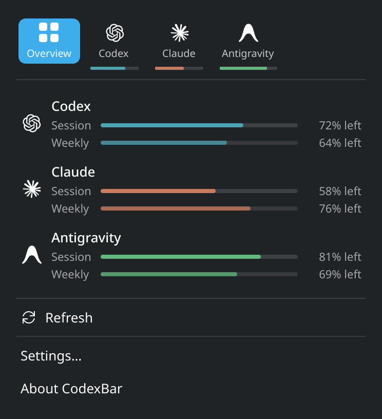
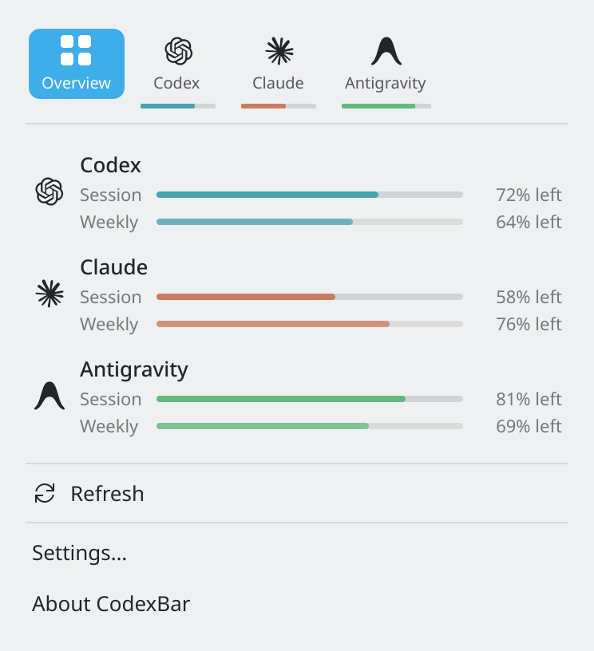
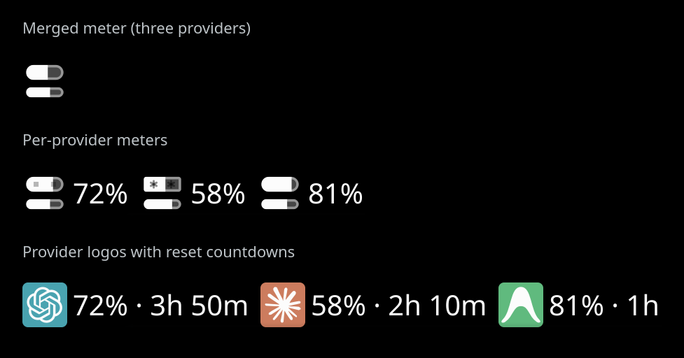
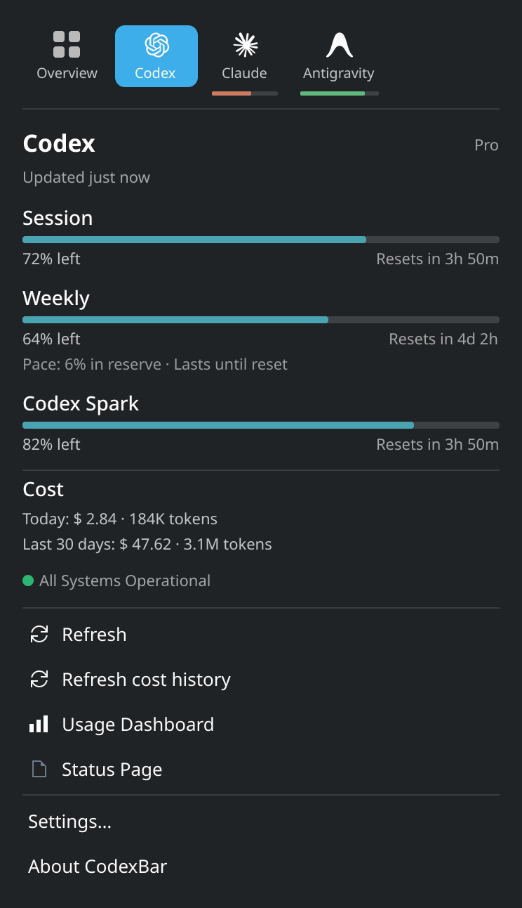
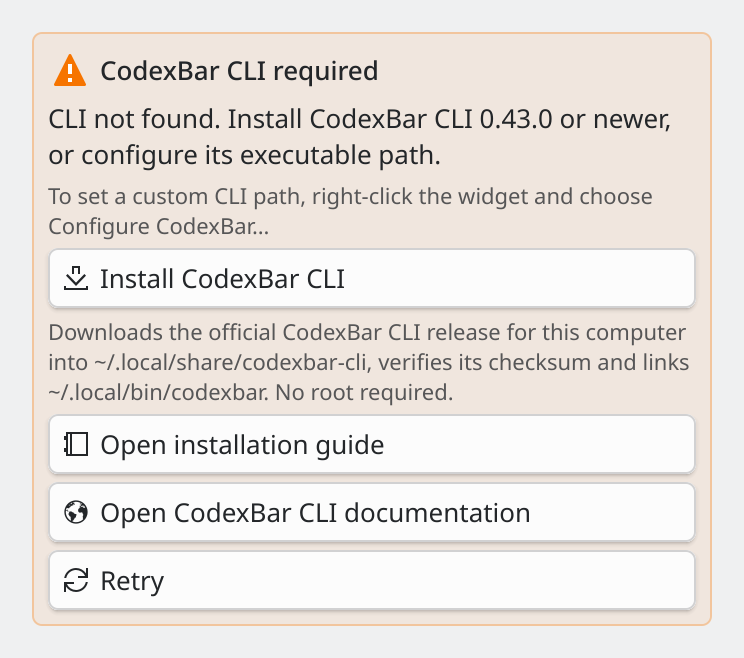
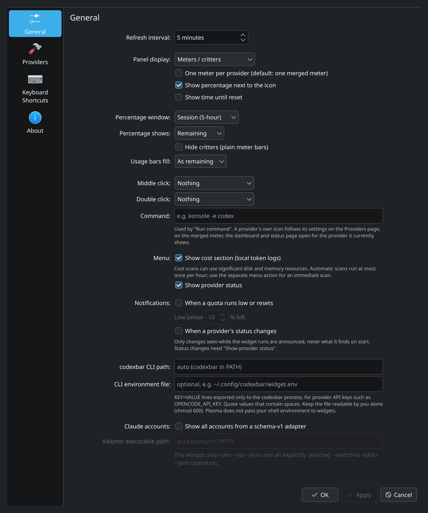
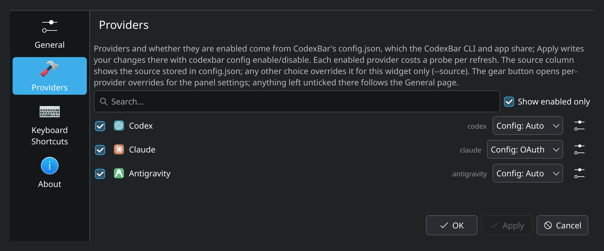

# Screenshot gallery and capture notes

The README uses just two visual blocks: an overview that follows GitHub's
`prefers-color-scheme` setting, and a compact comparison of panel modes.
Detailed controls belong here, where readers can open them at full resolution.
All seven files below are also candidates for maintainer review for the KDE
Store. The [review of the first renders](review.md) explains the revisions.

## Art direction

Use stock Breeze Dark and Breeze Light, Noto Sans 10 pt (8 pt secondary text),
native `QT_SCALE_FACTOR=2`, UTC and a frozen clock at 2026-10-06 12:00. Keep the
widget's own typography, colors, icons and spacing. No wallpaper, unrelated
applets, window decorations or cursor. All data is fictional; fixtures contain
plans but no email addresses or account identifiers. Bars show remaining quota.

Each capture has exactly 32 physical pixels (16 logical pixels) of padding on
all sides, sampled from an empty part of its rendered background. This removes
the faint seam without inventing a frame or recoloring the widget. Content is
never enlarged, shrunk or cut to fit a canvas. Popup and setup heights follow
their measured content; settings windows are resized before capture so the
footer stays in place and empty space is reduced. Panels use the smoke test's
640 × 140 logical-pixel viewer, keeping its toolbar below the icon strip. Only
the native 32 px icon grid is cropped; 6 logical pixels of canvas above and
below give each row the spacing of a normal 44 px panel.

| File | Native PNG size | Placement and purpose |
|---|---|---|
| `overview.png` | Expected 744 × 816 | Dark README hero and Store overview: three providers with session/weekly bars. Replaces `codexbar-plasma.png`. |
| `overview-light.png` | Expected 744 × 816 | Light README hero and Store light-theme view, with identical data and layout. |
| `provider-codex.png` | Expected 744 × ≈1296 | Gallery/Store only: session, weekly and Spark windows, resets, pace, costs, operational status and Pro plan. No account line. |
| `panel-modes.png` | Widest strip + 64 px × 512 | README and Store: merged meter, per-provider critters, logos with percentages/countdowns. Three native captures with captions outside the UI. Replaces both old logo examples with one comparison. |
| `settings-general.png` | 1920 × 2304 | Gallery/Store only: complete General page, including Notifications at their defaults and the custom CLI path field with its built-in placeholder. Replaces `panel-display-mode-settings.png`. |
| `settings-providers.png` | 1920 × 800 | Gallery/Store only: enabled providers, shared config.json and the current release's `Config: Auto` / `Config: OAuth` choices. |
| `cli-setup-light.png` | Card bounds + 64 px per dimension | Gallery/Store only: the real CLI setup card with **Install CodexBar CLI**, under Breeze Light. The CLI is intentionally unavailable; no installation is performed. |

The expected sizes describe the current layout. Actual sizes and hashes are
recorded in `manifest.txt`; bounds checks fail if content unexpectedly grows.
The vertical-logo example is omitted to keep the set focused. Source-selection
UI changes, including the proposed CLI 0.72.1 behavior, should be photographed
only after they land in the checkout being rendered.

## Gallery

Click any image to inspect its full-resolution PNG. The settings images are
kept out of the main README because fitting them into a small column makes the
labels and help text unreadable.

<a href="overview.png"></a>
<a href="overview-light.png"></a>

<a href="panel-modes.png"></a>

<a href="provider-codex.png"></a>
<a href="cli-setup-light.png"></a>

<a href="settings-general.png"></a>

<a href="settings-providers.png"></a>

## Render and review

Run **Documentation screenshots** (`.github/workflows/screenshots.yml`) on a
pull request or with `workflow_dispatch`. It uses the smoke job's Arch/Plasma
packages, plus explicit KDE Qt integration, Python and libfaketime. On an Arch
machine with those dependencies, from the checkout:

```sh
dbus-run-session -- bash tests/screenshots/render.sh "$PWD/dist/screenshots"
```

The output directory must be empty. The script starts its own Xvfb and isolates
each viewer's home, configuration, environment and CLI path. Only the existing
`tests/smoke/codexbar` supplies usage/config/cost data; its provider-list and
config helpers are reused with `tests/screenshots/fixtures/`. The setup scene
uses an explicitly nonexistent absolute executable path, so it cannot fall
through to another installed CLI. It checks the missing state, the enabled
Install button, and that the installer has never run.

Popups use the real FullView; panels use Plasma's panel containment; settings
use Plasma's configuration window. The setup image crops the actual setup
card, excluding unrelated empty quota content. `Probe.qml`, added only to
disposable package copies, reports state, visible text, buttons and geometry.
It draws nothing and changes no widget state. Navigation uses real X11 clicks.

Checks cover the frozen clock, theme, scale, font, correct CLI/config state,
providers, selected page, percentages, countdowns and cost. Email/account
lines, clipping, overflow, unexpected loading/errors, unchanged clicks and
unstable pixels fail the job. The intentional missing-CLI state is allowed
only for the setup shot. Three equal frames precede each capture. Panel checks
require all three provider delegates (or all three inputs to the merged meter),
native icon dimensions, and separation from the viewer toolbar. X11 pixel
checks reject missing/covered icons, missing logo colors and stray edges
outside the icon/label bounds. Their measurements are saved as `*.pixels.json`.
QML errors use the smoke test's patterns, scoped to the disposable widget
package; applet/containment load failures are also fatal. Upstream warnings and
the expected `cfg_configWriteError` / `cfg_configWriteErrorDefault` initial-property
warnings remain in the logs. The container
safe-directory, forced stderr logging and ImageMagick 7 AE parsing fixes are
retained. The smoke test itself is unchanged by this revision.
Capture groups run in separate shells: one failed group still fails CI, while
the other groups continue and contribute candidates and diagnostics to the
same artifact. A failed run can therefore include a partial contact sheet.

Send back the **whole `codexbar-screenshots-<commit SHA>` artifact**, containing:

- `images/overview.png`, `images/overview-light.png`, `images/provider-codex.png`,
  `images/panel-modes.png`, `images/settings-general.png`,
  `images/settings-providers.png`, and `images/cli-setup-light.png`.
- `contact-sheet.png`, `manifest.txt`, and `diagnostics/` (state JSON, native
  windows/content, individual panel strips, pixel checks, mock CLI calls,
  logs and package versions; on
  failure, the screen and window tree too).

These revisions still need a CI render and visual approval. After review,
copy the seven approved PNGs from `images/` here before merging; the main README
and gallery references are staged for those files. Arch is rolling, so exact
pixels across package upgrades are not guaranteed. Installed versions are
recorded with the artifact.

After maintainer approval, remove the four obsolete images, kept until then:
`codexbar-plasma.png`, `panel-display-mode-settings.png`,
`provider-logos-horizontal.png`, and `provider-logos-vertical.png`.
